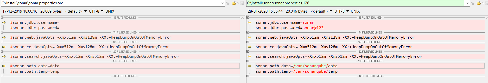

# Installation of sonar - centos 
```
sudo sudo
yum update -y
sudo yum install java-11-openjdk-devel
 
cd /tmp
wget https://binaries.sonarsource.com/Distribution/sonarqube/sonarqube-8.1.0.31237.zip
unzip sonarqube-8.1.0.31237.zip
mv sonarqube-8.1.0.31237 /opt/sonarqube
useradd -a -G sonar sonar
chown sonar. /opt/sonarqube -R


mkdir -p /var/sonarqube/temp
mkdir -p /var/sonarqube/data
chown sonar. /var/sonarqube -R
chown sonar. /var/sonarqube/temp -R
chown sonar. /var/sonarqube/data -R

#Add the these lines 
vi ~/.bashrc
========================
export SONAR_HOME=/opt/sonarqube
export JAVA_HOME=/usr/lib/jvm/java-11-openjdk-11.0.6.10-1.el7_7.x86_64
=======================

#Update this properties 

vi /opt/sonarqube/conf/sonar.properties
==============================
sonar.jdbc.username=sonar
sonar.jdbc.password=sonar@123

sonar.web.javaOpts=-Xmx512m -Xms128m -XX:+HeapDumpOnOutOfMemoryError

sonar.ce.javaOpts=-Xmx512m -Xms128m -XX:+HeapDumpOnOutOfMemoryError

sonar.search.javaOpts=-Xmx512m -Xms512m -XX:+HeapDumpOnOutOfMemoryError

sonar.path.data=/var/sonarqube/data
sonar.path.temp=/var/sonarqube/temp
==========================================



# update wrapper config 
vi /opt/sonarqube/conf/wrapper.conf
==========================================
wrapper.java.command=/usr/lib/jvm/java-11-openjdk-11.0.6.10-1.el7_7.x86_64/bin/java
==========================================


# add the service 

vi /etc/systemd/system/sonar.service
==========================================
[Unit]
Description=SonarQube
After=syslog.target network.target

[Service]
Type=forking

ExecStart=/opt/sonarqube/bin/linux-x86-64/sonar.sh start
ExecStop=/opt/sonarqube/bin/linux-x86-64/sonar.sh stop
LimitNOFILE=65536
LimitNPROC=4096

User=sonar
Group=sonar
Restart=always

[Install]
WantedBy=multi-user.target
==========================================

sudo systemctl daemon-reload
sudo systemctl enable sonar
sudo service sonar start

```

check the 
http:localhost:9000/


