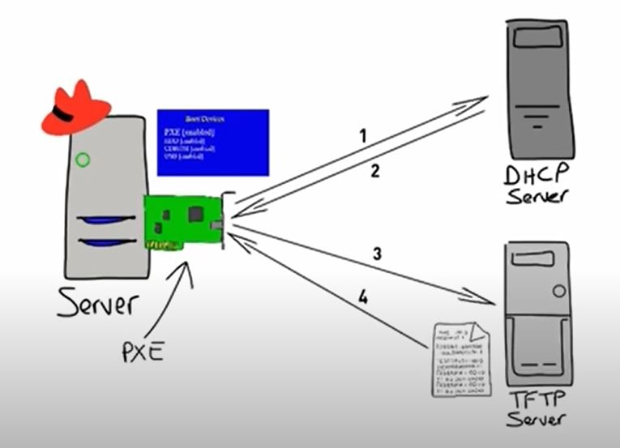
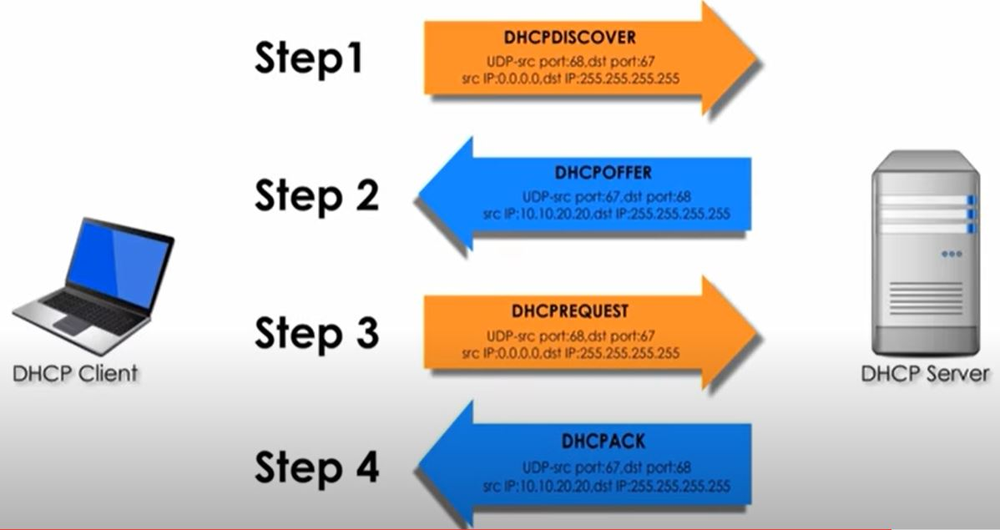
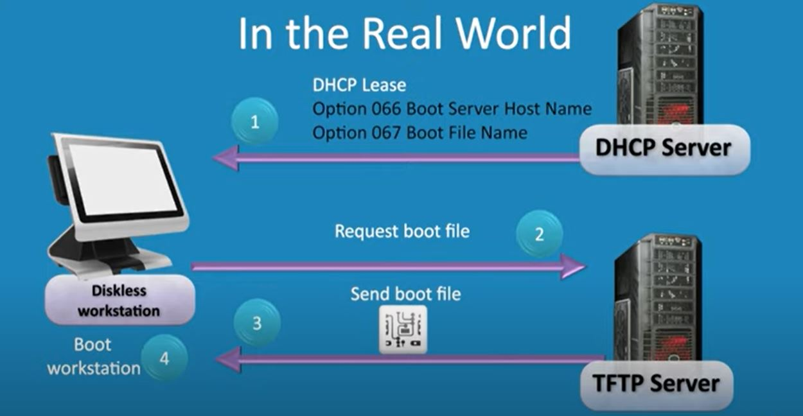

# ref:  https://ipxe.org/scripting
 - https://www.linuxtechi.com/configure-pxe-installation-server-centos-7/




# DHCP : Dynamic Host Configuration Protocol

ref:  
 - https://www.youtube.com/watch?v=IUOVSIKj6GU&ab_channel=SunnyClassroom
 
```
Windows>CMD

ipconfig/all
``` 


# Facts 
- It's clients are broadcast ,UDP not TCP
- Client use 68 and Server users 67

To reset the network configuration 
```
ipconfig/release 

```

To DHCP auto configure the network :

```
ipconfig/renew

```


# PXE  : Preboot eXecution Environment 

# ref:  
 - https://www.youtube.com/watch?v=Dm2k4H03L0s&ab_channel=itfreetraining
 - https://youtu.be/zQ-TQhmjhuc

 
# Facts 
- It helps in booting the Computer from network (If NIC supports )
- It is achieved by having small software in side the NIC(inside hardware)
- It supports two Protocols 
   - DHCP client 
   - TFTP (Trivial File Transfer Protocol) config : /etc/xinetd.d/tftp
    - No Authentication 
    - Downloads the basic booting and basic configuration files from the TFTP server 
    - TFTP server may control which IPs (or IP range ) can download the files ( at Firewall level by admin)




# BIOS (Basic Input Output System)
# ref : 
 - https://youtu.be/zIYkol851dU
- POST: Power On Self Test
- MBR: Master Boot Record 
- UEFI: Unified Extensible Firmware Interface  

- Once BIOS done POST it searches for some kind of bootable device which has the OS on it and once it finds the OS it hands over the control to OS 
- Older OS gets connected to I/O devices through BIOS (driver)
- Modern OS controls the I/O devices more directly (and BIOS goes for sleep all most)
- BIOS can only can access SSD with support of MBR can only handle <2TB
- So modern computers comes with UEFI


# SSD vs HDD (Solid State Drive vs Hard Disk Drive )
# ref : 
 - https://www.youtube.com/watch?v=L56c_wXADfs&ab_channel=TrakinTech
 - https://www.youtube.com/watch?v=Ji7TvlEbSMY&ab_channel=BCDTechnology
 - https://www.youtube.com/watch?v=HvfIeTieXOI&ab_channel=PowerCertAnimatedVideos
 
# Communication interface :
 SATA: old 6mb/s
 PCIe: Fastest 
# Protocol : 
 AHCI : Advance Host controller Interface (HDD)
 NVMe :Non Volatile Memory Express (SSD) 

# Partitions and Mounting
# ref: 
 - https://www.youtube.com/watch?v=BtSQIxDPnLc&ab_channel=thenewboston
 - https://www.youtube.com/watch?v=O5kh_-6e4kk&list=PL6gx4Cwl9DGCkg2uj3PxUWhMDuTw3VKjM&index=19&ab_channel=thenewboston
 - http://boron.physics.metu.edu.tr/ozdogan/OperatingSystems/week12/node5.html
 
